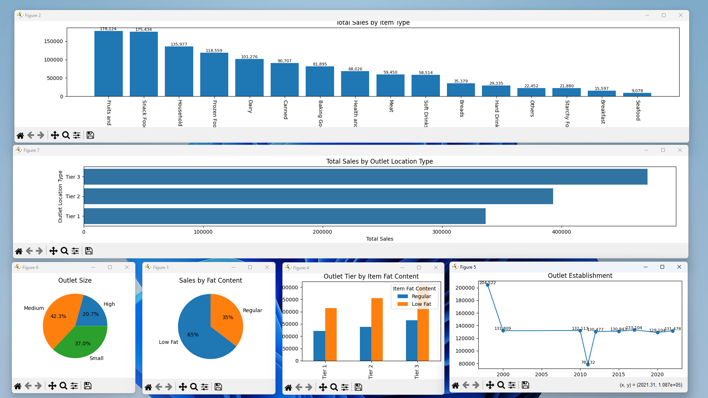
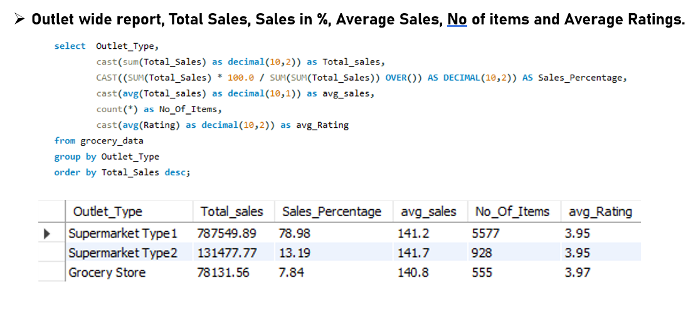
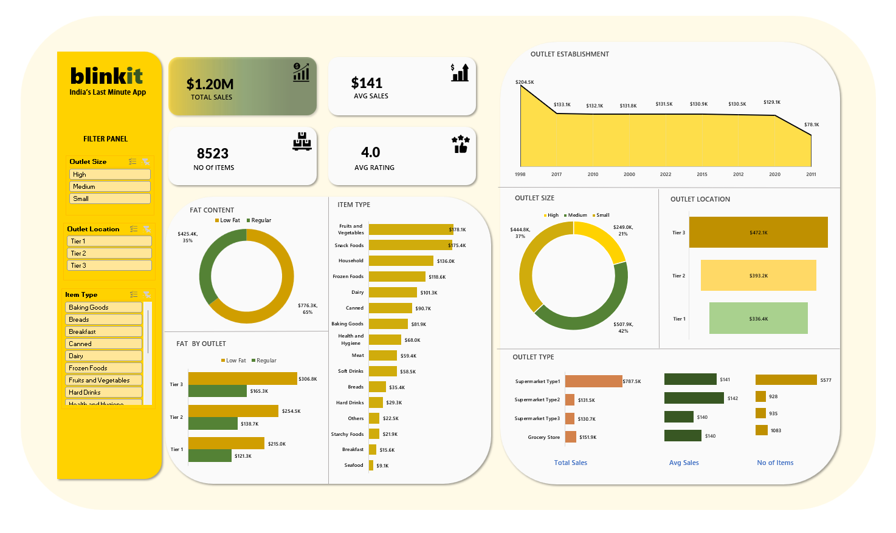
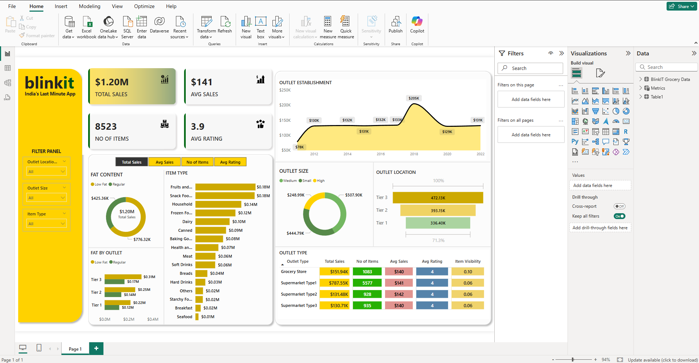
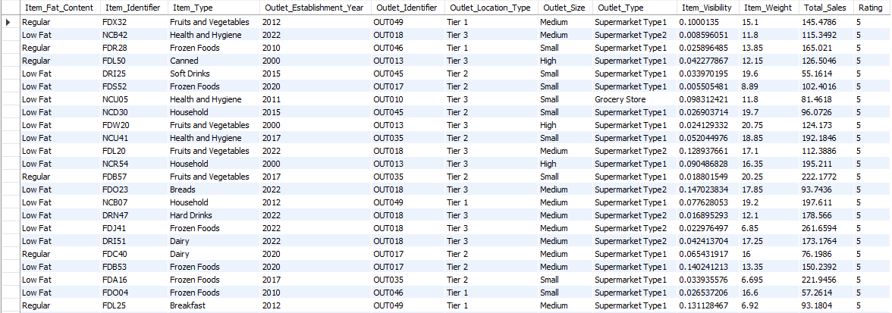

---

# Blinkit Sales & Grocery Data Analysis

This project focuses on analyzing Blinkit's sales and grocery data. The analysis is done using a combination of Python, Power BI, Excel, and SQL to extract meaningful insights and visualize trends.

The goal of this project is to provide an overview of Blinkit's sales performance, product distribution, and customer behavior. The project includes interactive dashboards, reports, and insights that were generated using different tools.

# Tools & Technologies

* **Python**: For data cleaning, manipulation, and analysis
* **Power BI**: For creating interactive dashboards and visualizations
* **Excel**: For preliminary analysis and ad-hoc calculations
* **SQL**: For querying and extracting data from relational databases

## 📂 Project Structure

```
/project-root
  ├── /images
  │     ├── blinkitGroceryData.png
  │     ├── excel-dashboard.png
  │     ├── pb-dashboard.png
  │     ├── py-all.png
  │     ├── sql-rep-1.png
  │     └── sql-rep-2.png
  ├── /scripts
  │     └── analysis.py
  ├── /data
  │     └── blinkit_sales_data.csv
  └── README.md
```

## 📈 Key Insights & Analysis

### 1. **Data Preprocessing & Exploration with Python**

Using Python, I cleaned and processed the raw Blinkit sales and grocery data. This involved:

* Removing duplicates
* Handling missing values
* Aggregating data at different levels (e.g., by region, product category)
* Visualizing the distribution of sales and products

#### Python Analysis Screenshot:



### 2. **SQL Queries for Data Extraction**

SQL was used to query the Blinkit sales database, extracting key data points such as product sales, order frequency, and customer demographics. This helped in creating the foundational data required for deeper analysis and visualization.

#### SQL Query Report 1:



#### SQL Query Report 2:


### 3. **Excel Dashboard**

An interactive Excel dashboard was created to provide a quick snapshot of the sales data. The dashboard allowed for easy filtering and comparison of sales trends across different product categories.

#### Excel Dashboard Screenshot:



### 4. **Power BI Dashboard**

A detailed Power BI dashboard was created to visualize sales performance, product trends, and key metrics. It includes:

* Interactive filters
* Sales by product category and region
* Time-based trends and insights

#### Power BI Dashboard Screenshot:



### 5. **Grocery Data Visualization**

A visual representation of the Blinkit grocery data was also created to understand which product categories are performing the best, and which areas of the market could benefit from optimization.

#### Grocery Data Visualization:



## 📊 Results & Key Findings

* **Sales Trends**: We observed that certain product categories, like fresh produce, showed consistent growth, while others, like non-perishable goods, had seasonal spikes.
* **Geographical Insights**: Specific regions showed higher sales volumes, indicating potential areas for targeted marketing.
* **Customer Preferences**: The analysis highlighted customer preferences for specific grocery items, which can be used to optimize product placement and inventory management.

## 🚀 How to Run the Project

1. Clone the repository to your local machine:

   ```bash
   git clone https://github.com/your-username/blinkit-sales-analysis.git
   ```
2. Navigate to the project directory:

   ```bash
   cd blinkit-sales-analysis
   ```
3. Install necessary dependencies:

   ```bash
   pip install -r requirements.txt
   ```
4. Run the Python analysis script:

   ```bash
   python scripts/analysis.py
   ```

## 💬 Future Improvements

* **Machine Learning Models**: Implementing predictive models to forecast future sales trends.
* **Customer Segmentation**: Using clustering techniques to better understand customer groups and tailor promotions.
* **Deployment**: Deploying the dashboard to a web platform for easier access and collaboration.

## 📜 License

This project is licensed under the MIT License - see the [LICENSE](LICENSE) file for details.

---
